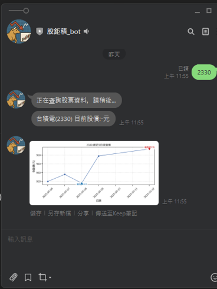
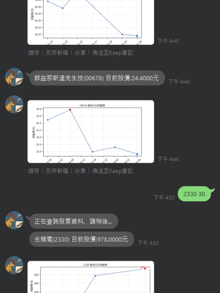
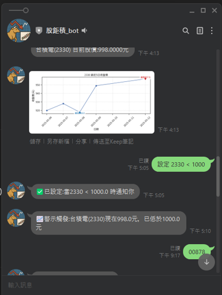
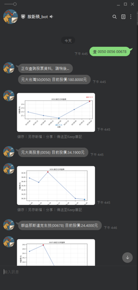

## Line Bot Stock 股價查詢機器人
這是一個使用 **Python** 開發的 LINE 機器人，提供台股股價查詢與走勢圖功能。  
使用者在 LINE 中輸入股票代號後，機器人會串接外部股價 API，回傳近期價格資訊與趨勢圖，協助快速掌握市場狀況。

---

## 功能
基本功能:
- 使用股票代號查詢個股資訊（例如：`2330`）
  - 回傳近期股價資訊（收盤價、成交量等）
  - 產生股價趨勢圖（折線圖）並以圖片回傳至 LINE
- 趨勢圖：輸入 `2330 30` 或 `查 2330 2317`(請文字與數字用空白隔開)
- 
進階功能:
- 支援查詢多檔股票，請用空白分隔（例：`查 2330 2881 2317`）
- 價格警示：輸入 `設定 2330 > 800`(請文字與數字、符號用空白隔開)
  - 每 5 分鐘會自動檢查是否達成價格條件
  - 圖表會自動標註最高價/最低價
- 基本錯誤處理（錯誤代碼、無此股票、API 失敗時顯示提示訊息）

---

## 專案架構
檔案結構：
```text
Line-bot-stock/
├─ app.py              # 主程式入口，處理 LINE webhook 與股價查詢邏輯
├─ requirements.txt    # Python 相依套件
├─ Procfile            # 部署到 PaaS（Render）使用的啟動設定
├─ fonts/              # 繪圖用的字型檔，確保圖表中文字顯示正常
└─ .gitignore
```

---

## Demo 範例
- 查詢股價後的回傳結果



- 查詢股價30日的趨勢圖的回傳結果



- 查詢股價價格警示的回傳結果



- 查詢多筆股價的回傳結果



---

## 技術重點
- Python + Flask 服務邏輯
- LINE Messaging API

資料處理與顯示:
- twstock 即時台股資料
- matplotlib + seaborn 圖表視覺化
- 自帶中文字型，100% 避免雲端亂碼
- Webhook 驅動價格檢查

雲端部署與流程:
- Render
- .env + Environment Variables 保護金鑰

---

## 專案收穫
- 完整實作後端 API、外部資料串接與圖表處理
- 理解 Webhook 與背景任務的差異與應用
- 熟悉雲端部署與 Log 診斷
- 訓練系統模組化、錯誤處理與程式結構能力
- 建立一個「真正可使用」的產品等級作品

---

## 未來可擴充方向
- 支援均線（MA5, MA20, MA60）
- KD / RSI 等技術指標
- SQLite 儲存使用者資料（持久化）
- 股票基本面查詢（EPS、營收）
- K 線圖生成
- 使用者個人化儀表板
